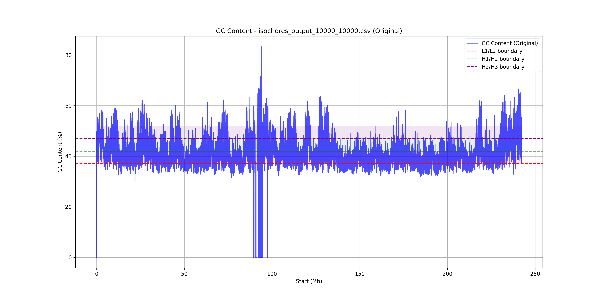
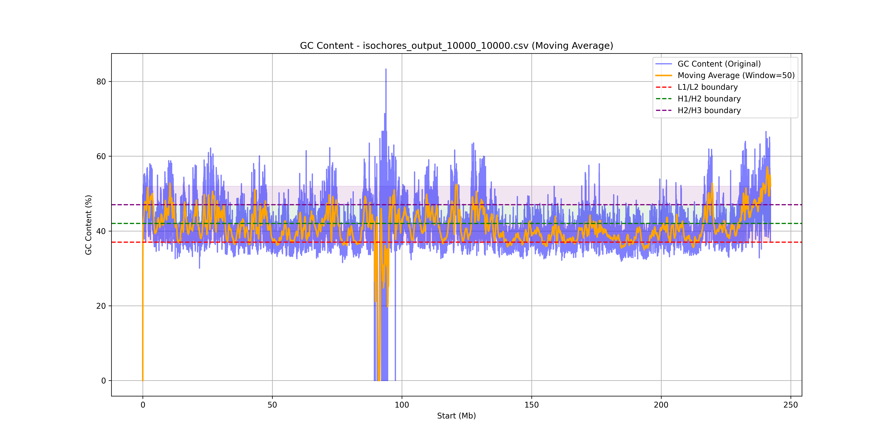
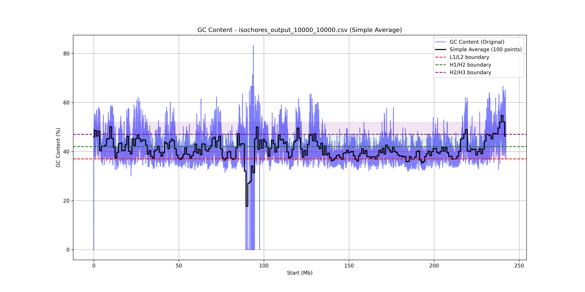

# 🧬 DNA Chart App

**DNA Chart App** is a powerful bioinformatics tool designed to analyze DNA sequences and generate insightful charts.  
The app supports multiple types of DNA analysis and visualization, including:  
✅ Word Frequency Analysis  
✅ Isochore GC Content Distribution  
✅ Scatter Plots  

Built with **Python** and a clean graphical user interface using **Tkinter**, this tool is ideal for genomic analysis and visualization.

---

## 📌 Features
### 🔎 1. Word Frequency Chart
- Analyzes DNA segments to calculate word frequency.  
- Filters based on a threshold value.  
- Generates a clean bar chart of the most common words.  

### 🧬 2. Isochore GC Content Chart
- Calculates the GC content across different segments.  
- Plots GC content against genomic positions.  
- Marks the classification boundaries (`L1/L2`, `H1/H2`, `H2/H3`).  

### 📊 3. Scatter Plot
- Visualizes DNA segment lengths vs. starting positions.  
- Interactive plots using **Plotly**.  
- Highlights best-matching DNA words.  

### 🎯 4. View Saved Charts
- Opens the saved charts folder directly from the app.  
- Works on **Windows, MacOS, and Linux**.  

---

## 🏗️ Project Structure
```
dna_chart_app/
├── src/
│   ├── chart_generator.py       # Word frequency chart logic
│   ├── isochore_plotter.py      # GC content calculation and plotting
│   ├── scatter_plotter.py       # Scatter plot generation
│   ├── gui.py                   # GUI interface with Tkinter
│   ├── main.py                  # CLI and GUI entry point
├── icons/                       # Application icons
├── dist/                        # Generated executable
├── build/                       # PyInstaller build files
├── images/                      # Example charts
├── .gitignore                   # Git ignore file
├── README.md                    # Project documentation
└── requirements.txt             # Dependencies
```

---

## 🖥️ Installation
### 1. Clone the Repository
Clone the project from GitHub:
```
git clone https://github.com/your-username/dna_chart_app.git
cd dna_chart_app
```

### 2. Set Up Virtual Environment  
Create and activate a virtual environment:
```
python -m venv venv
# Activate it:
# Windows
.env\Scriptsctivate
# MacOS / Linux
source venv/bin/activate
```

### 3. Install Dependencies  
Install the required dependencies:
```
pip install -r requirements.txt
```

### 4. Run the App  
To launch the GUI:
```
python src/main.py
```

To run from the command line:
```
python src/main.py
```

---

## 🛠️ Building an Executable
You can create a standalone executable using **PyInstaller**:

1. Install PyInstaller:
```
pip install pyinstaller
```

2. Create the `.exe` file:
```
pyinstaller --noconfirm --onefile --windowed --icon=icons/dna.ico src/main.py
```

3. The executable will be in the `dist/` folder:
```
dist/main.exe
```

---

## 🚀 Usage
### ✅ 1. Word Frequency Chart
- Select the input CSV file containing DNA segments.  
- Set a threshold for word frequency.  
- The app will display and save a bar chart.  


### ✅ 2. Isochore GC Content Chart
- Load a CSV file with DNA segments and GC content.  
- The app will display the GC content against genomic positions.  
- Classification boundaries are marked automatically. 





### ✅ 3. Scatter Plot
- Load a CSV file with segment start positions and lengths.  
- The app will generate an interactive scatter plot using Plotly.  

### ✅ 4. View Saved Charts
- Open the output folder directly from the app.  
- Works on Windows, MacOS, and Linux.  

---

## 🌐 Configuration
### `requirements.txt`
List of required Python packages:
```
pandas
matplotlib
numpy
plotly
Pillow
```

### `.gitignore`
List of files and folders ignored by Git:
```
__pycache__/
dist/
build/
*.spec
venv/
.idea/
.DS_Store
*.log
```

---

## 🌟 Sample Data Format
### 🔬 Sample CSV Format for Word Frequency & Isochore Analysis
| Start | End | Length | Cost      | Best Word  |
|-------|-----|--------|-----------|------------|
| 0     | 100 | 100    | 0.8       | ATG        |
| 100   | 200 | 100    | 1.2       | CGT        |
| 200   | 300 | 100    | 2.4       | TGC        |

---

## 💡 Troubleshooting
### ❌ Permission Denied (Public Key)
- Make sure your SSH key is added to GitHub:
```
ssh-add ~/.ssh/id_rsa
```

### ❌ DLL Load Failed
- Try rebuilding with:
```
pyinstaller --clean --noconfirm --onefile --windowed --icon=icons/dna.ico src/main.py
```

### ❌ Application Blocked by Antivirus
- Disable real-time protection in Windows Defender.  
- Add an exception for the build folder.  

---

## 🧠 Best Practices
✅ Keep your `.gitignore` updated  
✅ Use virtual environments for dependency isolation  
✅ Test with sample data before generating large charts  
✅ Create a clean commit history  

---

## 📜 License
This project is licensed under the **MIT License** – free to modify and use.  

---

## 👨‍💻 Contributing
We welcome contributions!  
✅ Open an issue for bugs or suggestions  
✅ Fork the repo and submit a pull request  

---

## 🌍 Author
**[Maxim Goryachev]** – [GitHub Profile](https://github.com/Goryachiy74)  
📧 **Contact:** goryachiy74@gmail.com  

---


---


